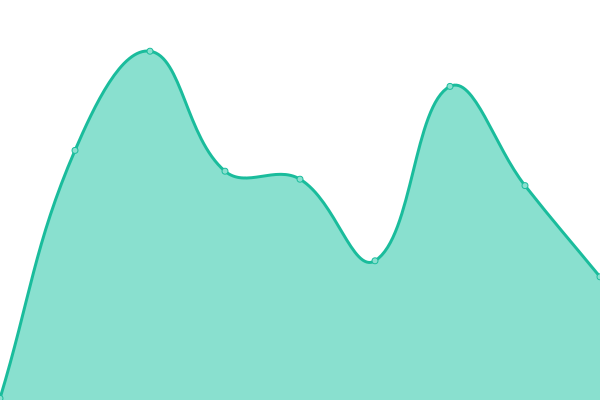

# [📈 Live Status](https://status.wuffs.net): <!--live status--> **🟧 Partial outage**

This repository contains the open-source uptime monitor and status page for [Sparks](https://status.wuffs.net), powered by [Upptime](https://github.com/upptime/upptime).

With [Upptime](https://upptime.js.org), you can get your own unlimited and free uptime monitor and status page, powered entirely by a GitHub repository. We use [Issues](https://github.com/SparksTheFolf/STF-Uptime-Status/issues) as incident reports, [Actions](https://github.com/SparksTheFolf/STF-Uptime-Status/actions) as uptime monitors, and [Pages](https://status.wuffs.net) for the status page.

<!--start: status pages-->
<!-- This summary is generated by Upptime (https://github.com/upptime/upptime) -->
<!-- Do not edit this manually, your changes will be overwritten -->
<!-- prettier-ignore -->
| URL | Status | History | Response Time | Uptime |
| --- | ------ | ------- | ------------- | ------ |
|  [Wuffs Main](https://wuffs.net/) | 🟩 Up | [wuffs-main.yml](https://github.com/SparksTheFolf/STF-Uptime-Status/commits/HEAD/history/wuffs-main.yml) | 

 232ms
     
 | 

<a href="https://status.wuffs.net/history/wuffs-main">100.00%</a>
    

|  [Blog](https://blog.trpn.dev) | 🟩 Up | [blog.yml](https://github.com/SparksTheFolf/STF-Uptime-Status/commits/HEAD/history/blog.yml) | 

 156ms
     
 | 

<a href="https://status.wuffs.net/history/blog">100.00%</a>
    

|  HMS Authority Issuance Server | 🟥 Down | [hms-authority-issuance-server.yml](https://github.com/SparksTheFolf/STF-Uptime-Status/commits/HEAD/history/hms-authority-issuance-server.yml) | 

 0ms
     
 | 

<a href="https://status.wuffs.net/history/hms-authority-issuance-server">0.00%</a>
    

|  HMS Authority Frontend Server | 🟥 Down | [hms-authority-frontend-server.yml](https://github.com/SparksTheFolf/STF-Uptime-Status/commits/HEAD/history/hms-authority-frontend-server.yml) | 

 0ms
     
 | 

<a href="https://status.wuffs.net/history/hms-authority-frontend-server">0.00%</a>
    

<!--end: status pages-->

[**Visit our status website →**](https://status.wuffs.net)

## 📄 License

- Powered by: [Upptime](https://github.com/upptime/upptime)
- Code: [MIT](./LICENSE) © [Sparks](https://status.wuffs.net)
- Data in the `./history` directory: [Open Database License](https://opendatacommons.org/licenses/odbl/1-0/)
